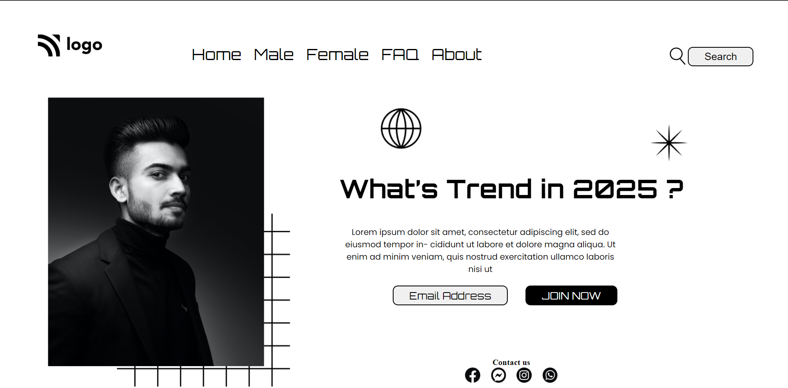

# Hello I am **Devang** and welcome to my first ever project.
I know the code quality is very very bad, I hope it gets 
better with every passing project. This project will always
be special to me.

# 💻 Tech Stack Used :

  

 

 ## Project Name : Restaurant Landing Page !

 
I did not learn anything from this new from this project but this project taught me something that is  more valuable  i.e. implementation. There is something magical about coding something and see its output then and there and its equally frustrating when we don't get the desired output. To be honest it took me 11-12 hrs to figure this out and the final output looks something  like this

 
### Do Check it Live on Below Link :

[Live Link !]()